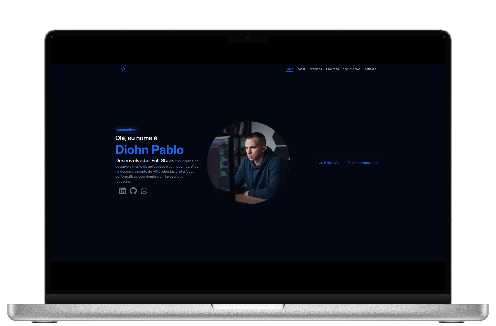

# <p align="center">🚀 Portfolio Pessoal — Diohn Pablo</p>

<p align="center">
  
  
  
</p>

<p align="center">
  <a href="#-sobre-o-projeto">Sobre</a> •
  <a href="#-tecnologias">Tecnologias</a> •
  <a href="#-funcionalidades">Funcionalidades</a> •
  <a href="#-estrutura-de-pastas">Estrutura</a> •
  <a href="#-como-executar">Execução</a> •
  <a href="#-contato">Contato</a>
</p>

<p align="center">
  
</p>

---

## 💻 Sobre o Projeto

Este é o meu **Portfólio Pessoal**, um ecossistema digital desenvolvido para consolidar minha trajetória como **Desenvolvedor Full Stack**. O projeto não é apenas uma vitrine de trabalhos, mas uma demonstração técnica de habilidades em arquitetura de software, design responsivo e performance.

> [!IMPORTANT]
> **Visão do Desenvolvedor:** "Minha missão é traduzir requisitos complexos em soluções de software escaláveis e de alto impacto, priorizando sempre a experiência do usuário e a eficiência do código."

---

## 🛠 Tecnologias

O projeto utiliza o que há de mais moderno no desenvolvimento web atual:

### **Core Stack**
<p align="left">
  
  
  
  
</p>

### **Ecossistema & Ferramentas**
*   **Motion (Framer Motion):** Orquestração de animações complexas e interações.
*   **React Icons:** Biblioteca unificada de ícones vetoriais.
*   **Node.js & PostgreSQL:** Experiência aplicada em back-ends escaláveis.
*   **Docker:** Ambiente de desenvolvimento padronizado.
*   **n8n:** Automações inteligentes de workflow.

---

## ✨ Funcionalidades

| Recurso | Descrição | Status |
| :--- | :--- | :---: |
| **Responsividade Total** | Interface adaptável para Mobile, Tablet e Desktop. | ✅ |
| **Galeria Interativa** | Projetos com cards dinâmicos e modal de visualização. | ✅ |
| **Tech Carousel** | Carrossel infinito apresentando o stack tecnológico. | ✅ |
| **Direct Contact** | Integração nativa com API do WhatsApp para leads rápidos. | ✅ |
| **CV Download** | Acesso imediato ao currículo profissional em PDF. | ✅ |
| **Dark UI** | Design moderno focado em legibilidade e conforto visual. | ✅ |

---

## 📂 Estrutura de Pastas

A organização segue padrões de escalabilidade e separação de interesses:

```text
src/
├── assets/         # Recursos estáticos (imagens, PDF, ícones)
├── components/     # Componentes atômicos e reutilizáveis
├── hooks/          # Lógica de estado compartilhada (ex: useIsMobile)
├── pages/          # Composições de página (Home.tsx)
├── sections/       # Seções modulares da landing page
├── utils/          # Helpers e funções utilitárias
└── main.tsx        # Bootstrap da aplicação
```

---

## 🚀 Como Executar o Projeto

### **Pré-requisitos**
*   [Node.js](https://nodejs.org/) (v18 ou superior)
*   Gerenciador de pacotes (`npm` ou `pnpm`)

### **Instalação**

1.  **Clonagem do Repositório:**
    ```bash
    git clone https://github.com/diohnpabloo/portfolio.git
    cd portfolio
    ```

2.  **Instalação de Dependências:**
    ```bash
    npm install
    # ou se preferir pnpm
    pnpm install
    ```

3.  **Ambiente de Desenvolvimento:**
    ```bash
    npm run dev
    ```
    Acesse: `http://localhost:5173`

---

## ✉️ Contato

Vamos construir algo incrível juntos?

<p align="left">
  <a href="https://www.linkedin.com/in/diohn-pablo-6541a3275/" target="_blank">
    
  </a>
  <a href="https://github.com/diohnpabloo" target="_blank">
    
  </a>
  <a href="https://wa.me/5585981380202" target="_blank">
    
  </a>
</p>

---

<p align="center">
  Desenvolvido com ☕ e 💻 por <strong>Diohn Pablo</strong>
</p>
